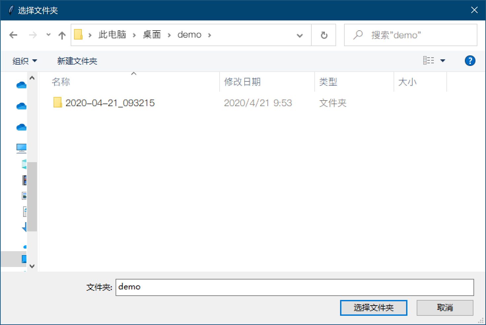
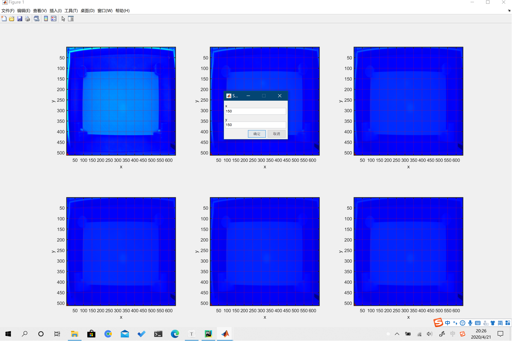
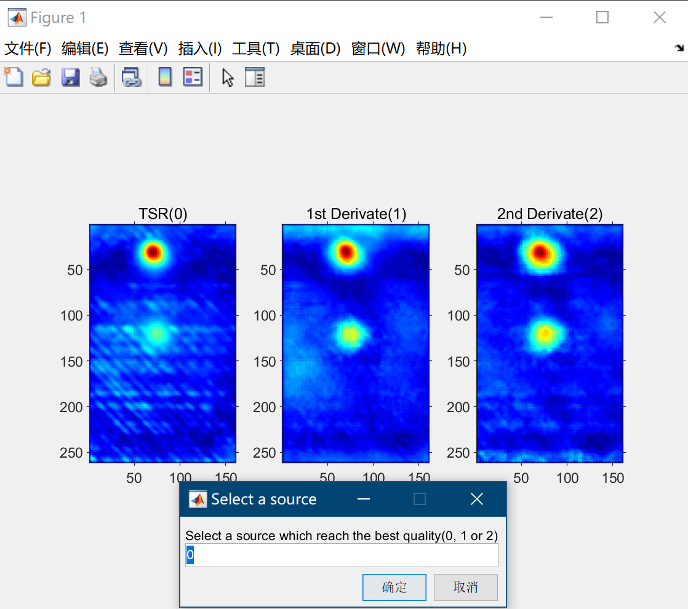
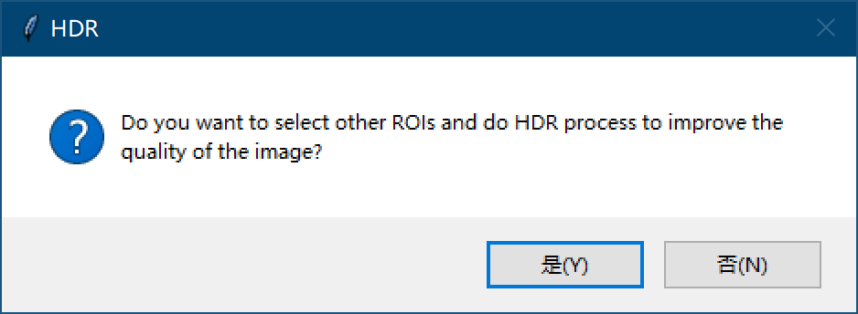
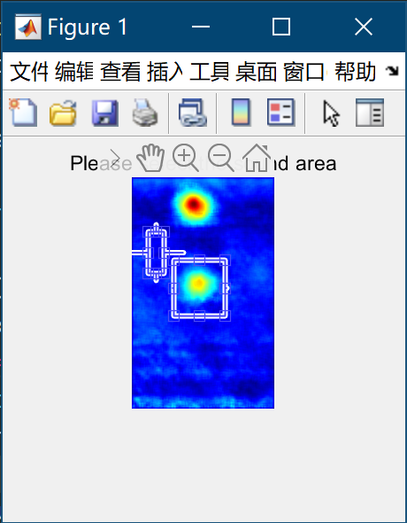

# Automatic data process for thermographic

A data process program for thermographic using MATLAB and Python, which can generate APTC map, binary map, confidence map and depth 3D model from RAW data with slightly manual operations. Create zip files and send to server in order to show the asset in Hololens.

## Deployment

### Installation

This program can only be launched in Windows (7, 8 and 10) with MATLAB R2019a and Python3  or later environments. The Installation instructions can be found:

[Python](https://www.python.org/) 

[MATLAB](https://www.mathworks.com/products/matlab.html)

### Requirements

As the program is based on Python, therefore, to run it, the required Python modules are as follows:

```
matlabengineforpython===R2019b
opencv-contrib-python==4.2.0.32
opencv-python==4.2.0.32
```

#### MATLAB API for Python

This is the only module which may require to be installed offline.

Before you install, verify your Python and MATLAB configurations.

* Check that you system has supported version of Python and MATLAB R2014b or later. To check that Python is installed your system, run Python at the operating system prompt.
* Add the folder that contains the Python interpreter to your path, if it is not already there.
* Find the path to the MATLAB folder. Start MATALB and type **matlabroot** in the window. Copy the path returned by **matlabroot**

To install the engine API, type commands below at Windows operating system prompt

```shell
cd "matlabroot\extern\engines\python"
python setup.py install
```

Any further information for MATLAB API for Python, please see [here](https://uk.mathworks.com/help/matlab/matlab_external/get-started-with-matlab-engine-for-python.html)

#### OpenCV for Python

To install OpenCV for Python, type the command below at Windows operating system prompt.

```shell
pip install opencv-python opencv-contrib-python
```

Please note that if you don't want to use APTC_HDR process, a function to improve the image quality, then OpenCV for Python is not necessary.

## Usage

### 0. Start the program

Click the "run.bat" then the program will start running.

### 1. Set a target folder

As the program start, a folder selection will pop up. Please select the folder that receive the RAW file.



### 2. Create asset name

When a RAW file comes, you will be asked to input an asset name. Any name will be allowed in theory, but if you want to upload the outcomes to the server and successfully show in Hololens, please ensure that there is a folder with the same name as you entered in the target folder uploaded to the server. This folder contains an xml file and a dat file after the asset is registered, which are necessary to ontology and Hololens. The target folder is set in auto.py (line 45).

```python
FolderToServer = 'C:\\Users\\luowe\\Cranfield University\\Li, Gen - Group Project\\Demonstration\\To Be Uploaded on Server_2' #Set Upload folder
```

### 3. TSR processing

The program will then calculate polynomial coefficients by using MATLAB. A default ROI have already set in order to fit in the situation in Cranfield University TESI lab. When the ROI definition dialog is popped up, just click the "OK" button for twice. If you want to custom the ROI, just enter coordinate of two points to define a rectangle. The 6 frames from the back aim to give you a preview to help you better define an ROI.



After that, the "TSRData.mat", "1stDerData.mat" and "2ndDerData.mat" will be generated.

* **Note**: To reduce the processing time as well as get the best quality images, it is highly recommended to define a smaller ROI than the default one.

### 4. APTC Mapping

All of the data generated can be applied with APTC algorithm and the outcomes vary from qualities. This program will calculate both of them and show them in the same window to help you choose the best quality one.



This process will form APTC map, confidence map and binary map.

### 5. APTC HDR

Sometimes, small damages cannot be seen very clear because there are other big damages which shows much greater value than the smaller ones, reduced the weight of small defects. **APTC HDR** allows you to select another ROI and convert all of the values into 256 color scale. By doing this, smaller damages can be seen more clear as well as the confidences of them will be increased.



Drag the mouse to define two rectangles (one for new ROI and another for new sound area). The more times that apply the **ATPC HDR**, the more likely to get a clear image with damage details.



* **Note**: Please ensure the OpenCV for Python is installed before you use **APTC HDR**

### 6. Peak Time Mapping

This process will generate 3D model (.obj) showing the depth of the damages which can be used to show in Hololens. The 3D model will be reconstructed to its original size. Depends on different size of parts to be tested, different coefficient should be set previously. Please see "PeakTimeMapping.m" (line 7 and 8):

```matlab
PeakTimeMap_recon = zeros(303, 447);
coefficient = 0.3356;
```

Two parameters in "PeakTimeMap_recon" defined the number of pixels of an actual part and the coefficient helps to convert pixel to mm. 

For converting the frame number to depth, line 64 give you an opportunity  to control and the parameters represent frequency and diffusivity.

```matlab
PeakTimeMap(i, j) = (PeakTimeMap(i,j)*3.1416*0.45/25).^0.5*0.1;%% 25 frequency %0.45mm^2/s difussivity
```

### 7. Create zip file

The MATLAB code will pass its control to Python after finishing 3D modelling. Then the python script will create a folder named "asset name_Themo" and move the 3D model into it. Then the asset name folder will completely be compressed and wait to be sent to the server.  The structure of a zip file will be like this:

> Asset Name.zip
>
> > Asset Name_Thermo
> >
> > > Asset Name_DamageView.obj
> >
> > Asset Name.dat
> >
> > Asset Name.xml
> >
> > Asset Name_QR.png
> >
> > Asset Name_Adaptive_peak_contrast_image.jpg
> >
> > Asset Name.obj

Then a cycle for data processing is completed. The Python script will back to the target folder and wait for another RAW file to come.

